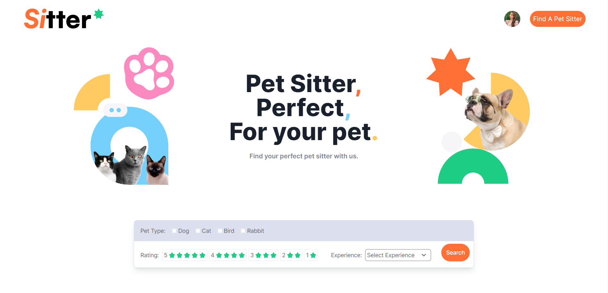

# Pet Sitter App (Pet care)

เป็น Web Application ที่เกี่ยวกับการรับดูแลสัตว์เลี้ยง โดยเจ้าของสัตว์เลี้ยงสามารถค้นหาผู้รับดูแลสัตว์เลี้ยงที่ไว้ใจและมีความเชื่อถือได้ในระหว่างที่ไม่อยู่บ้าน โดยสามารถค้นหาประวัติ รายละเอียดการบริการ และรีวิวการใช้บริการของผู้รับดูแลสัตว์เลี้ยงได้ และสามารถทำการจองเพื่อเข้าใช้บริการผ่านทางเว็บไซต์ได้



## ขั้นตอนในการติดตั้ง

```bash
git clone git@github.com:scarecrow-404/pet-sitter.git

cd pet-sitter

npm install
```

## ขั้นตอนการใช้งาน

```bash
npm run dev
```

## Deploy on Vercel

## เครดิต

สุพัตรา พิลึก (https://github.com/yungying-spk)
เกียรติศักดิ์ พิมพ์อาภรณ์ (https://github.com/enterpannet)
กิตติภูมิ พุทธรักษา (https://github.com/scarecrow-404)
ฐิตธิษณ์ อัครณัฐประพิณ (https://github.com/KritTitatit)
ธรธัญ เรืองชัยยง (https://github.com/Lhinglhingrchy)
ปารเมศ ระหะหมัดประเสริฐ (https://github.com/SODIKCP)
